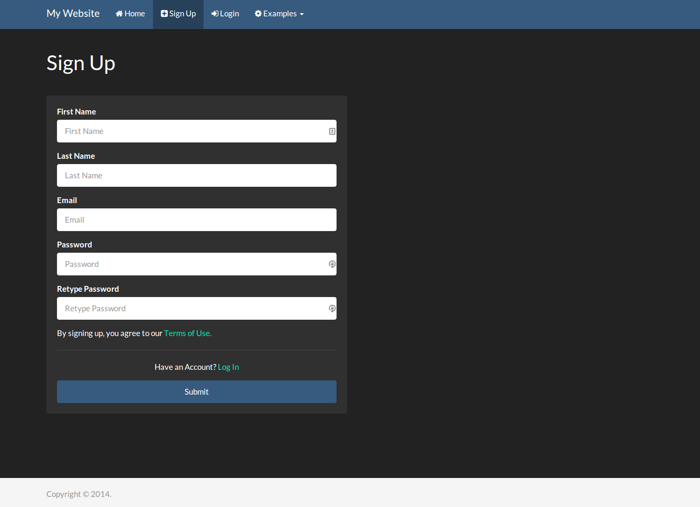
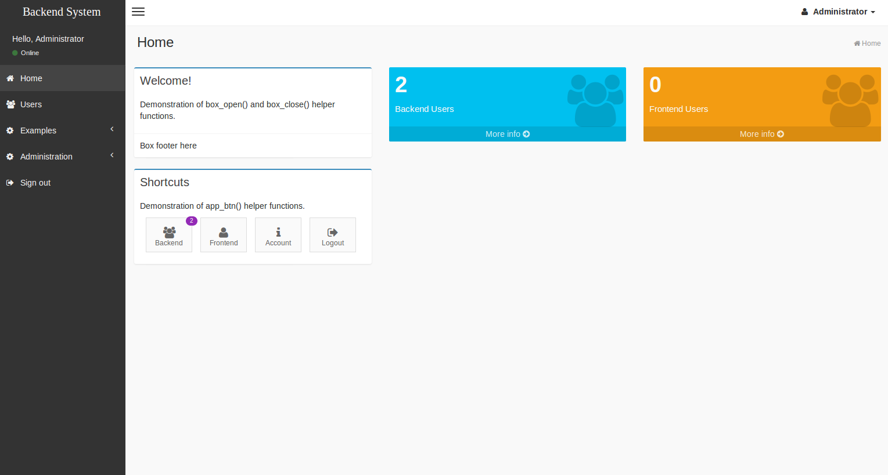

## CodeIgniter Bootstrap

A starter template that supports multi-tenant (frontend / backend) website in a single application.

This repository is developed upon the following tools: 
* [CodeIgniter](http://ellislab.com/codeigniter) (v2.2.0) - PHP framework
* [Bootstrap](http://getbootstrap.com/) (v3.2.0) - popular frontend framework
* [Bootswatch](http://bootswatch.com/) (v3.2.0) - theme options capatible to Bootstrap framework
* [Grocery CRUD](http://www.grocerycrud.com/) (v1.4.1) - feature-rich library to build CRUD tables
* [Image CRUD](http://www.grocerycrud.com/image-crud) (v0.6) - CRUD library for image management
* [AdminLTE](https://github.com/almasaeed2010/AdminLTE) (v1.3) - bootstrap theme for backend system
* [codeigniter-base-model](https://github.com/jamierumbelow/codeigniter-base-model) - MY_Model implementation for easier database handling 

Please note this project will change from time to time (breaking changes is unavoidable among commits by now), but should works fine at production (e.g. in my personal jobs). 


### Setup Procedure

1. Git clone this repository to a LAMP / WAMP server
3. In prior to use both frontend & backend system, create a MySQL database (e.g. named "ci_bootstrap"), then import data from sql/ci_bootstrap.sql
4. Update database config file (e.g. under applications/backend/config)
4. Frontend Website can be visited via link like: http://localhost/ci_bootstrap/
5. Backend System can be visited via link like: http://localhost/ci_bootstrap/backend.php; and login as **admin**/**admin** or **staff**/**staff**
6. That's it! You should see a fancy membership-enabled frontend, as well as an AdminLTE dashboard from backend


### Helpers

Some useful helpers are created for better code reuse throught the project; any of them can be easily edited depends on your own use. 

* **alert_helper**: to handle form message (e.g. success/error) in a easy way
* **auth_helper**: to handle user authentication
* **MY_email_helper**: to handle email sending operations
* **MY_form_helper**: to shorten CodeIgniter's form validation; and functions to generate common form elements
* **MY_html_helper**: to generate AdminLTE widgets
* **MY_url_helper**: shortcut functions to reach assets


### Asset Customization (e.g. additional js/css files)

A grunt file (**Gruntfile.coffee**) is prepared for asset pipeline. To make use of it, you need to pre-install the following tools before building the template:

* [node.js](http://nodejs.org/): which includes a package manager (npm) for node modules
* [bower](http://bower.io/): package manager for bower components (to handle third-party assets)
* [grunt](http://gruntjs.com/): task runner for lots of purposes, e.g. compile, combine and minify scripts

Afterwards, change directory from your terminal to where you cloned the repository.

1. Update **bower.json** then call bower to download third-party packages: ```bower install```
2. Update **package.json** then install grunt packages: ```npm install```
3. Update **Gruntfile.coffee** (which is written in CoffeeScript), then use grunt command to start preset tasks: ```grunt```
4. After all you will find the post-processed files under the **"assets/dist"** folder, means you have successfully configured it :)


### Screenshots

Frontend - Sign Up: 



Backend - Home: 



More screenshots can be viewed from the [screenshots folder](https://github.com/waifung0207/ci_bootstrap/blob/master/screenshots/) under this repository.


### Changelog

Project changelog is recorded down in the [CHANGELOG file](https://github.com/waifung0207/ci_bootstrap/blob/master/CHANGELOG.md).


### TODO

* Add example of using Image CRUD
* 404 pages for both frontend / website
* Multilingual support
* More helpers to enhance code reusability
* Better documentation
